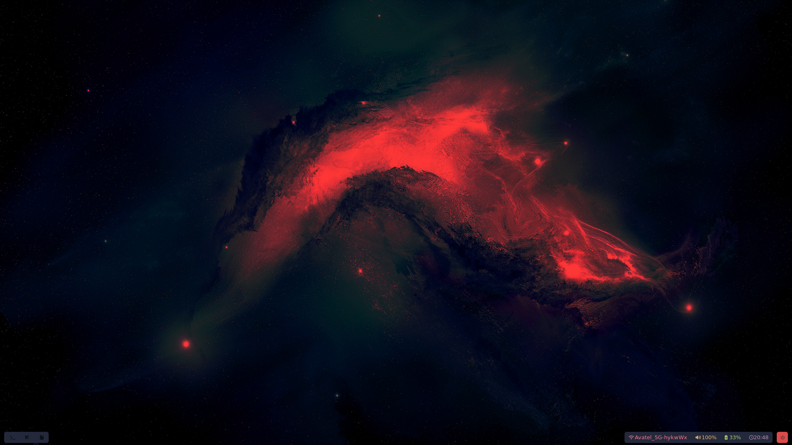
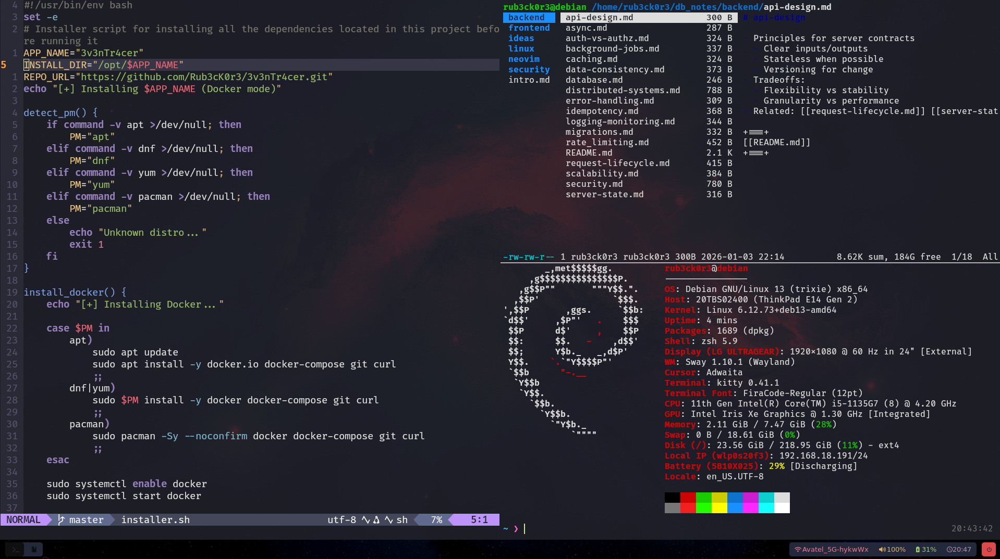
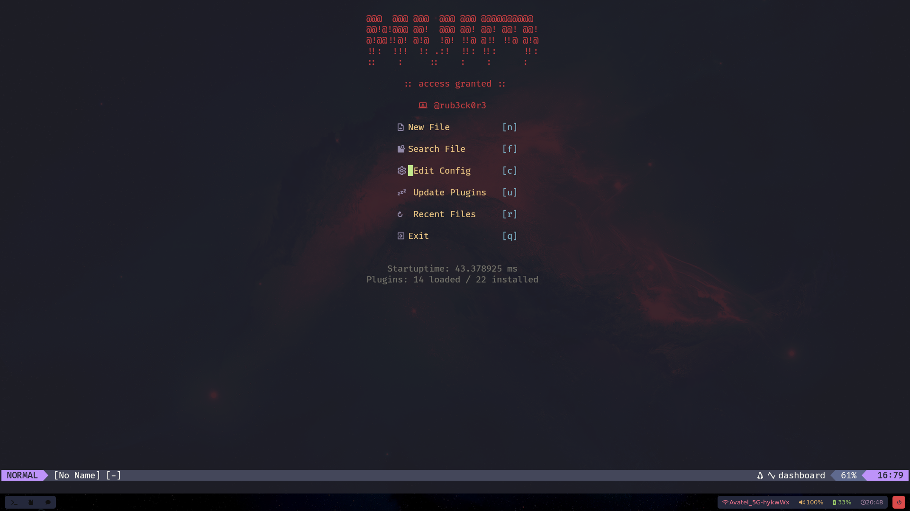
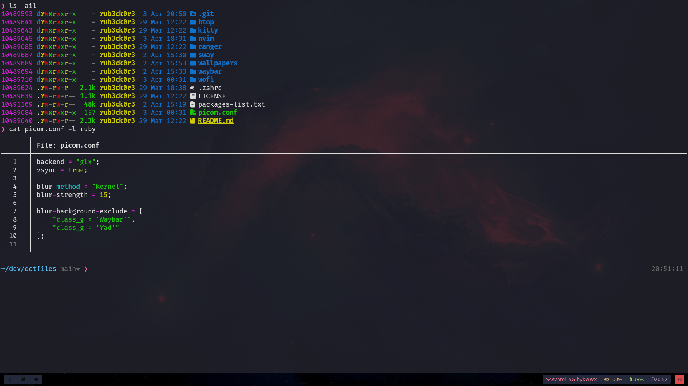

# 💻 Sway Dotfiles

A curated, **full-featured Sway environment** with custom keybindings, status bar scripts, Neovim development setup, and beautiful themes.

## 📸 Preview Images

> Background & Waybar:

---
> Multitask Preview:

---
> Neovim Custom Dashboard:

---
> Miscellaneous:


## 📂 Repository Structure

```
dotfiles/
├── sway/           # Sway config with custom keybindings & workspace layouts
├── waybar/         # Status bar configs, styles, and utility scripts
├── wofi/           # App launcher themes and styling
├── kitty/          # Terminal emulator configuration
├── nvim/           # Neovim setup with plugins & LSP
├── ranger/         # Terminal file manager configuration
├── picom.conf      # Compositor configuration (transparency, shadows)
├── htop/           # Custom htop configuration
└── wallpapers/     # Desktop wallpapers
```

---

## ✨ Features

* **Sway**: Custom workspaces, floating rules, and optimized keybindings
* **Waybar**: Modular status bar with scripts for audio, brightness, weather, updates, and power draw
* **Wofi**: Multiple launch themes (Tokyo, Cat)
* **Neovim**: Lazy-loaded plugins, LSP setup for many languages, UI customizations
* **Kitty**: Configured for optimal font rendering and color schemes
* **Picom**: Smooth transparency, shadows, and animations
* **Ranger**: Enhanced terminal file management

---

## ⚙️ Requirements

| Component    | Purpose                | Optional? |
| ------------ | ---------------------- | --------- |
| Sway         | Wayland compositor     | No        |
| Waybar       | Status bar             | Yes       |
| Wofi         | App launcher           | Yes       |
| Kitty        | Terminal emulator      | No        |
| Neovim       | Editor                 | No        |
| Ranger       | Terminal file manager  | No        |
| Picom        | Compositor for effects | Yes       |
| Grim & Slurp | Screenshots            | Yes       |
| wl-clipboard | Clipboard utilities    | Yes       |

## 🎨 Appearance

* Wallpapers: Located in `wallpapers/`
* Waybar Styles: `waybar/style.css` and `waybar/src/style2.css`
* Wofi Styles: `wofi/style.css` and theme folders

---

## 📝 Contributing

Contributions are welcome! Fork the repository, tweak keybindings, scripts, or themes, and submit a pull request.

---

## 📄 License

MIT License – see [LICENSE](LICENSE)

